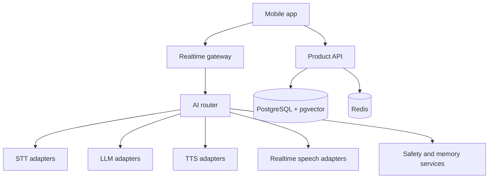

# Architecture and AI routing

## Logical architecture



## Recommended boundaries

- Mobile owns capture/playback, local animation, UI state and a small encrypted cache.
- Gateway owns authenticated realtime sessions, VAD events, interruption and backpressure.
- AI router owns provider selection, health, fallback, budgets and cost attribution.
- Conversation orchestrator owns prompts, persona, tool policies and turn lifecycle.
- Memory service owns extraction, user approval, retrieval, summaries and deletion.
- Safety service owns input/output classification and crisis/escalation UX.
- Billing service owns entitlements, metering, limits and webhook reconciliation.

## Bootstrap deployment profile — USD 1,000/month ceiling

- Prefer managed CPU/serverless services that scale to zero or low idle cost.
- No permanent GPU fleet; avatars animate on-device and AI inference uses APIs.
- Separate development/staging from production logically, but keep staging ephemeral during early validation.
- Set provider and infrastructure budget alarms at 50%, 75% and 90%; stop nonessential free usage before the hard cap.
- Cache only safe, reusable artifacts; never cache private conversations across users.
- Keep a premium fallback disabled by default for free users.
- Require an explicit cost estimate before enabling any feature that can create background inference.

## Provider interfaces

Use domain objects rather than leaking vendor formats:

```ts
interface SpeechToTextProvider {
  transcribeStream(input: AudioStream, ctx: ProviderContext): AsyncIterable<TranscriptEvent>;
}

interface LanguageModelProvider {
  stream(messages: DomainMessage[], options: LlmOptions, ctx: ProviderContext): AsyncIterable<LlmEvent>;
}

interface TextToSpeechProvider {
  synthesizeStream(text: AsyncIterable<TextChunk>, voice: VoiceConfig, ctx: ProviderContext): AsyncIterable<AudioChunk>;
}

interface RealtimeSpeechProvider {
  createSession(config: RealtimeConfig, ctx: ProviderContext): Promise<RealtimeSession>;
}
```

Add equivalent moderation and embedding interfaces. Every response must include usage fields sufficient for cost attribution.

## Candidate provider registry

Treat all entries as candidates until officially verified for the target region and legal entity.

| Capability | Candidates | Notes |
|---|---|---|
| Streaming STT | Qwen/Alibaba, Volcengine, MiniMax if available, international fallback | Benchmark Spanish/English accuracy, endpointing and residency. |
| Low-cost LLM | Qwen, DeepSeek, MiniMax, Doubao | Test personality adherence, safety and Spanish. |
| Streaming TTS | MiniMax, Qwen, Volcengine | Test voice naturalness, cloning terms, latency and commercial rights. |
| Realtime speech | Qwen Omni Realtime or other verified option | Use only if effective cost/latency beats modular pipeline. |
| Premium fallback | Gemini/xAI/other approved provider | Reserved for selected plans or degraded primary route. |
| Embeddings | multilingual open model or API | Prefer portable vectors and version metadata. |

Do not invent model IDs, endpoints or prices. Keep them in a versioned provider registry:

```yaml
provider: example
region: singapore
capabilities: [stt, tts]
verified_at: YYYY-MM-DD
pricing_source: OFFICIAL_URL
data_retention: UNKNOWN
training_opt_out: UNKNOWN
enabled: false
```

## Routing policy

Inputs:

- language and locale;
- user region and permitted data route;
- plan and remaining budget;
- requested voice/persona quality;
- current provider health and latency;
- predicted token/audio duration;
- conversation sensitivity;
- safety state.

Example priority score:

`score = qualityWeight*quality - costWeight*estimatedCost - latencyWeight*p95Latency + healthWeight*health`

Hard constraints run before scoring: region allowed, retention acceptable, capability available, safety tier supported and spend cap not exceeded.

## Memory model

Maintain separate layers:

- ephemeral turn buffer;
- rolling session summary;
- candidate memories extracted asynchronously;
- approved long-term memories;
- persona/relationship state with bounded fields;
- safety-relevant state with strict retention policy.

Each memory stores provenance, confidence, created/updated time, visibility and deletion status. Sensitive memories should require explicit user approval. Retrieval uses semantic relevance plus recency and importance; never inject the full history.

## Latency targets for MVP

- speech end → final transcript: target p50 < 500 ms after endpointing;
- speech end → first audio byte: target p50 < 1.5 s, p95 < 3 s;
- interruption → playback stop: target < 200 ms;
- provider fallback should not duplicate spoken responses.

Targets are hypotheses and must be measured on real target devices and networks.

## Avatar strategy

Start with a licensed/original 3D rig and conventional animation:

- phoneme/viseme mapping from TTS timing if available;
- amplitude fallback for lip movement;
- emotion tags emitted through a constrained schema;
- finite state machine for idle, listen, think, speak and interrupt;
- gesture library selected locally;
- no cloud generation per frame.

Run a technical spike comparing embedded Unity against a lighter Three.js/native approach before committing.
